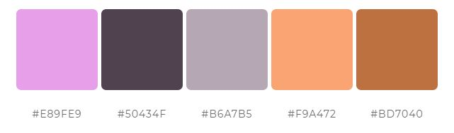

  
```{r setup, include=FALSE}
knitr::opts_chunk$set(echo = TRUE, fig.align = "center", message = FALSE)
```

# Learning Objectives<br>

* Practice making plots with ggplot2
* Create your own theme and use it with plots

# Background

QikBit is a start-up company producing low cost fitness trackers. Their flagship product, the KwikBit Unit1 (spot the mistake on the patent form) reproduces the functionality of the best-in-class commercial fitness trackers, but is cheap to make.  They are currently preparing to pitch to a potential investor and require a selection of charts to include in their presentation and promotional materials.

# Data

The data for this assignment is provided in the `CodeClanData` package.

* `qb_revenue_breakdown`
* `qb_monthly_sales`
* `qb_competitors`
* `qb_device_data`

Take a little time before you start to familiarise yourself with the data.

```{r}
devtools::install_github('codeclan/CodeClanData')

library(CodeClanData)

rev <- CodeClanData::qb_revenue_breakdown
sales <- CodeClanData::qb_monthly_sales
competitors <- CodeClanData::qb_competitors
device <- CodeClanData::qb_device_data
col_scheme <- c("#E89FE9", "#50434F", "#B6A7B5", "#F9A472", "#BD7040")
```


# MVP

## Part 1

1. Take the data in the dataset `qb_revenue_breakdown` and make a stacked bar chart showing the sources of revenue across the two years in the dataset.
```{r}
ggplot(rev) +
  geom_bar(aes(x = Year, y = Revenue, fill = Product), stat = "identity")  +
  ggtitle("sources of revenue"
  ) + 
  scale_y_continuous(labels = scales::comma) +
  theme(
    title = element_text(size = 13),
    axis.title = element_text(size = 11),
    text = element_text(size = 12),
    panel.background = element_rect(fill = "white"),
    panel.grid.major = element_line(colour = "grey98")
    ) +
  scale_colour_manual(values = col_scheme)
```


2.	Make a line chart showing monthly sales of the "flagship product" - the 'KwikBit Unit 1' - over the last year. This data is inside `qb_monthly_sales`, but you will need to use `filter()` or `subset()` (base `R)`.
```{r}

unit1_sales <- sales %>% 
  filter(Cashflow == "Kwikbit Unit 1 Sales")
ggplot(unit1_sales) +
  geom_line(
    aes(x = Date, y = Amount)
  )  +
  ggtitle("monthly sales of KwikBit Unit 1"
  ) +
  theme(
    title = element_text(size = 13),
    axis.title = element_text(size = 11),
    text = element_text(size = 12),
    panel.background = element_rect(fill = "white"),
    panel.grid.major = element_line(colour = "grey98")
    ) +
  scale_colour_manual(values = col_scheme)
```


3.	Make a line chart showing monthly revenue and costs over the last year. This data is also in `qb_monthly_sales`.								
```{r}
q3_sales <- sales %>% 
  filter(Cashflow %in% c("Total Revenue", "Cost"))
ggplot(q3_sales) +
  geom_line(
    aes(x = Date, y = Amount, group = Cashflow, colour = Cashflow) 
  ) +
  ggtitle("monthly revenue and costs"
  ) +
  scale_y_continuous(labels = scales::comma) +
  theme(
    title = element_text(size = 13),
    axis.title = element_text(size = 11),
    text = element_text(size = 12),
    panel.background = element_rect(fill = "white"),
    panel.grid.major = element_line(colour = "grey98")
    ) +
  scale_colour_manual(values = col_scheme)
```

4.	Show annual sales of personal fitness trackers over the last 5 years broken down by company as a ribbon plot (use `geom_area`). This data is in `qb_competitors`.
```{r}
competitors <- competitors %>% 
  mutate(sales_thousands = Revenue / 1000)

ggplot(competitors) +
  geom_area(
    aes(x = Year, y = sales_thousands, colour = Company)) +
  ggtitle("annual sales of personal fitness trackers"
  ) +
  scale_y_continuous(labels = scales::comma) +
  theme(
    title = element_text(size = 13),
    axis.title = element_text(size = 11),
    text = element_text(size = 12),
    panel.background = element_rect(fill = "white"),
    panel.grid.major = element_line(colour = "grey98")
    ) +
  scale_colour_manual(values = col_scheme)
```

5. Now show the sales from the four competitors as a line graph. Include an extra layer that shows the data points used to make the lines.
```{r}
ggplot(competitors) +
  geom_line(aes(x = Year, y = sales_thousands, colour = Company), alpha = 0.25) +
  geom_point(aes(x = Year, y = sales_thousands, colour = Company), alpha = 0.5) +
  ggtitle("annual sales of personal fitness trackers"
  ) +
  scale_y_continuous(labels = scales::comma) +
  theme(
    title = element_text(size = 13),
    axis.title = element_text(size = 11),
    text = element_text(size = 12),
    panel.background = element_rect(fill = "white"),
    panel.grid.major = element_line(colour = "grey98")
    ) +
  scale_colour_manual(values = col_scheme)
```


6. Now the company wants to compare the number of steps that their device counts vs. their competitors. Make a line graph of the number of steps throughout time, and use faceting to compare between companies and people. The data for this is in `qb_device_data`.
```{r}
ggplot(device) +
  geom_line(aes(x = hours, y = counts, group = id, colour = device), alpha = 0.25) +
    facet_wrap(~device, scales = 'free_y', labeller = label_both) +
    scale_x_continuous(breaks = 4:24, limits = c(4, 24)) + 
    ggtitle("step count by devices"
  ) +
  scale_y_continuous(labels = scales::comma) +
  theme(
    title = element_text(size = 13),
    axis.title = element_text(size = 11),
    text = element_text(size = 12),
    panel.background = element_rect(fill = "white"),
    panel.grid.major = element_line(colour = "grey98")
    ) +
  scale_colour_manual(values = col_scheme) 
```


## Part 2 

Take the plots that you produced in part one and now polish them by:

1. Adding appropriate labels
2. Changing the scales and coordinates when appropriate.
3. Applying a unified theme, which is described below:
  * Graphs should have white backgrounds, and use colour sparingly.
  * There should be faint grid lines.
  * Font sizes should be ~12pt although titles should be slightly larger and axis labels can be slightly smaller. 
  * All plots should use colours from the following company colour scheme.

```{r, eval=TRUE, echo=FALSE, fig.cap="", out.width = '100%'}

```

```{r, echo=TRUE}
col_scheme <- c("#E89FE9", "#50434F", "#B6A7B5", "#F9A472", "#BD7040")
```


# Extension

Try out different ways of plotting these three datasets. Which graphs do you think are particularly effective at showing QikBit's success?
